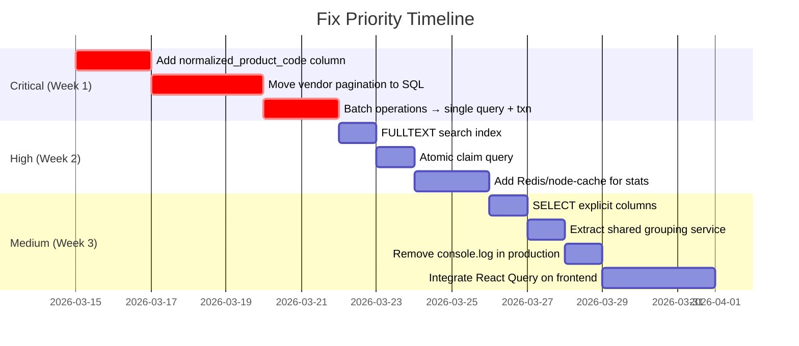

# APPROACH AUDIT REPORT — Clamio_v2

## 1. Executive Summary

The codebase has **two distinct quality tiers**. The admin panel endpoints use properly architected SQL-level pagination with parallel count queries — a correct, scalable pattern. However, **all vendor-facing endpoints use a fundamentally broken pagination approach**: they fetch the entire dataset from MySQL into Node.js memory, group/sort in JavaScript, then slice the array for "pagination." This means every page request loads every row.

**Biggest architectural weaknesses:**

| Rank | Issue | Impact |
|------|-------|--------|
| 1 | **Vendor pagination is fake** — all data is fetched every time | O(N) memory per request, server will crash at scale |
| 2 | **Product image JOINs use triple REGEXP_REPLACE** | Full table scan on every query, cannot use indexes |
| 3 | **Batch operations are N+1 sequential loops** | 100 orders = 300+ sequential DB queries |
| 4 | **Search uses leading-wildcard `LIKE '%term%'`** | Full table scan, index-blind |
| 5 | **No caching layer at any level** | Every dashboard load executes 4+ complex JOINs |
| 6 | **No database transactions** on multi-step mutations | Data corruption on partial failures |

---

## 2. Feature-by-Feature Review

---

### 2.1 Pagination

#### Vendor Endpoints (BROKEN)

| Detail | Value |
|--------|-------|
| **Files** | [orders.js:700-890](file:///c:/Users/keval/Desktop/App%20Development/Claimio_v2/Clamio_v2/backend/routes/orders.js#L700-L890) (my-orders), [L897-1045](file:///c:/Users/keval/Desktop/App%20Development/Claimio_v2/Clamio_v2/backend/routes/orders.js#L897-L1045) (handover), [L1052-1207](file:///c:/Users/keval/Desktop/App%20Development/Claimio_v2/Clamio_v2/backend/routes/orders.js#L1052-L1207) (order-tracking), [L1376-1539](file:///c:/Users/keval/Desktop/App%20Development/Claimio_v2/Clamio_v2/backend/routes/orders.js#L1376-L1539) (grouped) |
| **DB methods** | [database.js:4754](file:///c:/Users/keval/Desktop/App%20Development/Claimio_v2/Clamio_v2/backend/config/database.js#L4754) [getGroupedOrders](file:///c:/Users/keval/Desktop/App%20Development/Claimio_v2/Clamio_v2/frontend/lib/api.ts#758-786), [L4815](file:///c:/Users/keval/Desktop/App%20Development/Claimio_v2/Clamio_v2/backend/config/database.js#L4815) [getMyOrders](file:///c:/Users/keval/Desktop/App%20Development/Claimio_v2/Clamio_v2/backend/config/database.js#4810-4869), [L4875](file:///c:/Users/keval/Desktop/App%20Development/Claimio_v2/Clamio_v2/backend/config/database.js#L4875) [getHandoverOrders](file:///c:/Users/keval/Desktop/App%20Development/Claimio_v2/Clamio_v2/frontend/lib/api.ts#787-814) |

**Current approach:**
```
DB → SELECT * (ALL rows, no LIMIT) → Node.js memory → forEach grouping → Array sort → .slice(start, end) → respond
```

**Why it fails:**
- Requesting page 1 of 50 still fetches 5,000+ rows from MySQL
- The grouping loop (`forEach` → object accumulator) runs on the full dataset every time
- Memory usage is O(N) per request, not O(page_size)
- Sorting with `new Date()` construction on every element is O(N log N) per request
- Summary aggregations (`reduce`) also traverse the full dataset

**Risks:**
- 10,000 orders × 20 concurrent vendors = 200,000 row-objects in RAM simultaneously
- Node.js single-threaded: grouping blocks the event loop for every request
- Response time degrades linearly with data growth

**Best approach:**
```sql
-- Push grouping, sorting, and pagination into SQL
SELECT order_id, 
       MIN(order_date) as order_date,
       COUNT(*) as total_products,
       SUM(quantity) as total_quantity
FROM orders o
JOIN claims c ON o.unique_id = c.order_unique_id
WHERE c.claimed_by = ?
GROUP BY order_id
ORDER BY order_date DESC
LIMIT ? OFFSET ?
```
Then fetch product details only for the returned page of order_ids. Two-query approach: (1) grouped+paginated order headers, (2) product details for those specific order_ids.

#### Admin Endpoints (CORRECT)

| Detail | Value |
|--------|-------|
| **Files** | [database.js:3987-4130](file:///c:/Users/keval/Desktop/App%20Development/Claimio_v2/Clamio_v2/backend/config/database.js#L3987-L4130) [getOrdersPaginated](file:///c:/Users/keval/Desktop/App%20Development/Claimio_v2/Clamio_v2/backend/config/database.js#3976-4134), [L4136-4382](file:///c:/Users/keval/Desktop/App%20Development/Claimio_v2/Clamio_v2/backend/config/database.js#L4136-L4382) [getAdminOrdersPaginated](file:///c:/Users/keval/Desktop/App%20Development/Claimio_v2/Clamio_v2/backend/config/database.js#4135-4383) |

**Current approach:**
- Uses SQL `LIMIT/OFFSET` with parameterized queries ✅
- Runs `COUNT(*)` and `SELECT` in `Promise.all()` for parallel execution ✅
- Uses connection pool when available ✅

**Weaknesses:**
- `OFFSET` pagination degrades at high page numbers (MySQL scans all skipped rows)
- COUNT query re-executes the full JOIN + WHERE clause on every page

**Better approach at scale:**
- Keyset/cursor pagination (`WHERE order_date < ? ORDER BY order_date DESC LIMIT 50`)
- Cache the total count and invalidate on data changes, rather than recounting per request

---

### 2.2 Search Queries

| Detail | Value |
|--------|-------|
| **Backend** | [database.js:4022-4032](file:///c:/Users/keval/Desktop/App%20Development/Claimio_v2/Clamio_v2/backend/config/database.js#L4022-L4032), [L4184-4194](file:///c:/Users/keval/Desktop/App%20Development/Claimio_v2/Clamio_v2/backend/config/database.js#L4184-L4194) |
| **Frontend** | [admin-dashboard.tsx:1747](file:///c:/Users/keval/Desktop/App%20Development/Claimio_v2/Clamio_v2/frontend/components/admin/admin-dashboard.tsx#L1747) (500ms debounce) |

**Current approach:**
```sql
WHERE o.order_id LIKE '%search%' OR o.product_name LIKE '%search%' 
  OR o.product_code LIKE '%search%' OR o.customer_name LIKE '%search%'
```

**Why it's suboptimal:**
- Leading wildcard `%search%` prevents any index usage — forces full table scan
- 4 OR conditions across 4 columns = worst case: 4 full table scans
- On 50K+ orders, this will take seconds instead of milliseconds
- Only the admin dashboard has a 500ms debounce — vendor search triggers on every keystroke

**Best approach:**
1. **MySQL FULLTEXT index**: `MATCH(order_id, product_name, product_code, customer_name) AGAINST(? IN BOOLEAN MODE)` — orders of magnitude faster
2. If exact prefix matching is acceptable, use `LIKE 'search%'` (no leading wildcard) — uses index
3. For production scale, use a **search engine** (Elasticsearch/Meilisearch) fed asynchronously

---

### 2.3 Product Image JOINs (REGEXP_REPLACE)

| Detail | Value |
|--------|-------|
| **Files** | [database.js:4086-4094](file:///c:/Users/keval/Desktop/App%20Development/Claimio_v2/Clamio_v2/backend/config/database.js#L4086-L4094), [L4788-4793](file:///c:/Users/keval/Desktop/App%20Development/Claimio_v2/Clamio_v2/backend/config/database.js#L4788-L4793), [L4325-4331](file:///c:/Users/keval/Desktop/App%20Development/Claimio_v2/Clamio_v2/backend/config/database.js#L4325-L4331), [L4849-4853](file:///c:/Users/keval/Desktop/App%20Development/Claimio_v2/Clamio_v2/backend/config/database.js#L4849-L4853) |

**Current approach:**
```sql
LEFT JOIN products p ON (
  REGEXP_REPLACE(TRIM(REGEXP_REPLACE(o.product_code, '[-_](XS|S|M|...)$', '')), '[-_]{2,}', '-') = p.sku_id OR
  REGEXP_REPLACE(TRIM(REGEXP_REPLACE(o.product_code, '[-_][0-9]+-[0-9]+$', '')), '[-_]{2,}', '-') = p.sku_id OR
  REGEXP_REPLACE(TRIM(REGEXP_REPLACE(o.product_code, '[-_][0-9]+$', '')), '[-_]{2,}', '-') = p.sku_id
)
```

**Why it's terrible:**
- **For every row**, MySQL executes **6 REGEXP_REPLACE calls** and **3 OR conditions**
- Functions on JOIN conditions prevent index usage — forces **nested loop full table scan**
- The subquery `SELECT sku_id, account_code, MIN(image) FROM products GROUP BY ...` materializes a temp table every time
- This runs on **every single query** across all endpoints — it's the single biggest performance killer

**Performance math:** 10,000 orders × 500 products = 5,000,000 regex evaluations per query

**Best approach:**
1. **Add a `normalized_product_code` column** to the orders table (computed on insert/update)
2. **Pre-compute** the stripped code: `CREATE INDEX idx_normalized_code ON orders(normalized_product_code)`
3. **Create a products lookup table** with [(normalized_sku, account_code, image)](file:///c:/Users/keval/Desktop/App%20Development/Claimio_v2/Clamio_v2/backend/services/shipwayService.js#959-961) — maintained by a trigger or on product import
4. JOIN becomes a simple `ON orders.normalized_product_code = product_images.normalized_sku`

---

### 2.4 Batch Operations (Bulk Assign/Unassign/Claim)

| Detail | Value |
|--------|-------|
| **Files** | [orders.js:1940-2043](file:///c:/Users/keval/Desktop/App%20Development/Claimio_v2/Clamio_v2/backend/routes/orders.js#L1940-L2043) (bulk-assign), [L2051-2219](file:///c:/Users/keval/Desktop/App%20Development/Claimio_v2/Clamio_v2/backend/routes/orders.js#L2051-L2219) (bulk-unassign) |

**Current approach:**
```javascript
for (const uid of unique_ids) {
  const order = await database.getOrderByUniqueId(uid);    // Query 1
  const carrier = await carrierService.getTop3Carriers();   // Query 2 (+ external API)
  await database.updateOrder(uid, {...});                   // Query 3
}
```

**Why it's bad — classic N+1:**
- 100 orders = 300+ sequential database queries
- Each [getOrderByUniqueId](file:///c:/Users/keval/Desktop/App%20Development/Claimio_v2/Clamio_v2/backend/config/database.js#3683-3732) is a separate `SELECT` with JOINs
- Each [updateOrder](file:///c:/Users/keval/Desktop/App%20Development/Claimio_v2/Clamio_v2/backend/config/database.js#4996-5139) is a separate `UPDATE`
- External carrier API calls are also sequential
- No transaction wrapping — failure at item 50 leaves 49 committed and 50 undone
- Total time: ~100 × (5ms SELECT + 10ms carrier + 5ms UPDATE) = 2 seconds minimum
- HTTP request may timeout on large batches

**Best approach:**
```sql
-- Step 1: Batch-read all orders in one query
SELECT * FROM orders WHERE unique_id IN (?, ?, ?, ...)

-- Step 2: Parallel carrier lookups
await Promise.allSettled(orders.map(o => carrierService.getTop3(o)))

-- Step 3: Batch-update in one query (inside a transaction)
BEGIN;
UPDATE claims SET status='claimed', claimed_by=? WHERE order_unique_id IN (...);
COMMIT;
```

---

### 2.5 Dashboard Statistics

| Detail | Value |
|--------|-------|
| **Files** | [orders.js:1214-1369](file:///c:/Users/keval/Desktop/App%20Development/Claimio_v2/Clamio_v2/backend/routes/orders.js#L1214-L1369) (vendor dashboard-stats), [L1546-1636](file:///c:/Users/keval/Desktop/App%20Development/Claimio_v2/Clamio_v2/backend/routes/orders.js#L1546-L1636) (admin dashboard-stats) |

**Current approach:** ✅ Good
- 4 SQL `COUNT(DISTINCT ...)` aggregations run in `Promise.all()` — correct use of parallel execution
- Uses connection pool for concurrent queries
- Pushes computation to the database layer

**Remaining weakness:**
- These 4 heavy JOIN queries execute on **every dashboard page load**, with no caching
- At scale, this is 4 complex JOINs across `orders`, `claims`, `labels`, `store_info` on every refresh

**Better approach:**
- Add a **Redis/memory cache** with 30-60 second TTL for dashboard counts
- Invalidate on claim/unclaim/label-download events
- Or use **materialized views** / pre-calculated stats table updated by a cron job

---

### 2.6 Data Fetching — Frontend

| Detail | Value |
|--------|-------|
| **Files** | [api.ts](file:///c:/Users/keval/Desktop/App%20Development/Claimio_v2/Clamio_v2/frontend/lib/api.ts) (1,805 lines), [useAsyncTask.ts](file:///c:/Users/keval/Desktop/App%20Development/Claimio_v2/Clamio_v2/frontend/hooks/useAsyncTask.ts) |

**API Client approach:** Good retry logic with exponential backoff (3 retries, jitter). Handles network errors, timeouts, and AbortController. ✅

**Weaknesses:**
- No request deduplication — navigating back to a page re-fetches the same data
- No SWR/React Query pattern — stale data isn't shown while refetching
- Every API method logs vendorToken and request details to `console.log` in production
- [getGroupedOrders](file:///c:/Users/keval/Desktop/App%20Development/Claimio_v2/Clamio_v2/frontend/lib/api.ts#758-786), [getHandoverOrders](file:///c:/Users/keval/Desktop/App%20Development/Claimio_v2/Clamio_v2/frontend/lib/api.ts#787-814), etc. all pass page/limit params but the backend ignores them for SQL (fake pagination)

**Best approach:**
- Use **TanStack Query** (React Query) or **SWR** for:
  - Automatic deduplication
  - Stale-while-revalidate
  - Background refetching
  - Cache management
  - Optimistic updates for claim/unclaim

---

### 2.7 Order Grouping Logic

| Detail | Value |
|--------|-------|
| **Files** | [orders.js:760-830](file:///c:/Users/keval/Desktop/App%20Development/Claimio_v2/Clamio_v2/backend/routes/orders.js#L760-L830) (repeated 4 times) |

**Current approach:** The exact same 70-line grouping block is copy-pasted across `/my-orders`, `/handover`, `/order-tracking`, and `/grouped` endpoints. Each groups orders by `order_id`, accumulates products, calculates totals, sorts by date, computes summary stats.

**Why it's bad:**
- 4 copies of identical logic — every bug fix must be applied 4 times
- Grouping is done in JavaScript on the full dataset (should be SQL `GROUP BY`)
- Sorting by creating `new Date()` objects for comparison is slow

**Best approach:**
- SQL `GROUP BY order_id` with aggregations
- Extract shared grouping logic into a service function (DRY)
- Use `GROUP_CONCAT` or a two-query approach to get products for each grouped order

---

### 2.8 Caching

**Current approach:** None. Zero caching exists at any level.

- No HTTP cache headers (`Cache-Control`, `ETag`)
- No Redis or in-memory cache
- No `stale-while-revalidate` pattern on the frontend
- No memoization of expensive computations
- Dashboard stats are recomputed from scratch on every load
- Carrier lists, store info, user lists — all re-queried every time

**Best approach (tiered):**
1. **HTTP caching**: `Cache-Control: max-age=30` on read-only endpoints (carrier list, product images, store list)
2. **Application cache**: Redis or `node-cache` for dashboard stats, carrier lists, user lookups (30-60s TTL)
3. **Frontend cache**: React Query / SWR with configured staleTime
4. **Database cache**: MySQL query cache or materialized views for dashboard aggregations

---

### 2.9 Concurrency & Race Conditions

| Detail | Value |
|--------|-------|
| **Files** | [orders.js:437-552](file:///c:/Users/keval/Desktop/App%20Development/Claimio_v2/Clamio_v2/backend/routes/orders.js#L437-L552) (claim), bulk operations |

**Current approach (claim):**
```javascript
const order = await database.getOrderByUniqueId(uid);  // Step 1: READ
if (order.status !== 'unclaimed') return;                // Step 2: CHECK
await database.updateOrder(uid, { status: 'claimed' });  // Step 3: WRITE
```

**Why it fails:** Classic TOCTOU (Time of Check to Time of Use). Between Step 1 and Step 3, another request can claim the same order.

**Best approach:**
```sql
UPDATE claims SET status='claimed', claimed_by=? 
WHERE order_unique_id=? AND status='unclaimed';
-- Check: affectedRows === 1 means success, 0 means already claimed
```
Single atomic query. No race condition possible.

---

### 2.10 Response Payload Size

**Current approach:** `SELECT o.*` returns ALL columns from the orders table, including columns the frontend never uses. The admin query also JOINs users, customer_info, labels, claims, products, and store_info — returning 30+ columns per row.

**Why it's wasteful:**
- `o.*` includes `created_at`, `updated_at`, `is_in_new_order`, internal flags the frontend never renders
- Product image URLs are fetched even when not displayed (list view vs detail view)
- The response includes `console.log` of the entire JSON (`line 1522: console.log(JSON.stringify(responseData, null, 2))`)

**Best approach:**
- Select only the columns the frontend actually uses
- Use different projections for list view (minimal) vs detail view (full)
- Remove all response body logging

---

## 3. Performance and Scalability Risks

### Will Break Under Scale

| Risk | Trigger Point | Impact |
|------|--------------|--------|
| Vendor pagination (fetch-all) | >5,000 orders per vendor | Node.js OOM crash or >5s response times |
| REGEXP_REPLACE JOIN | >20,000 orders × >1,000 products | >10s query time, MySQL timeout |
| Sequential batch operations | >50 orders in bulk assign | >10s HTTP timeout, partial completion |
| `LIKE '%search%'` | >50,000 orders | >5s search response, bad UX |
| Dashboard stats (no cache) | >20 concurrent users | MySQL connection pool exhaustion |
| `console.log(JSON.stringify(fullResponse))` | Any large response | Event loop blocked, memory spike |
| No `LIMIT` on vendor DB queries | Data growth over time | Linear degradation, eventual crash |

### Causing Unnecessary Load Right Now

| Source | Wasted Resources |
|--------|-----------------|
| 6 REGEXP_REPLACE calls per row per query | CPU cycles on every request |
| Full dataset fetch for every vendor paginated request | RAM, network bandwidth, GC pressure |
| Sequential for-loops in batch operations | Wall-clock time, connection hold time |
| 30+ `console.log` calls per request with JSON serialization | CPU, I/O, log storage |
| No caching on dashboard stats | 4 heavy JOINs × every page load |
| `COUNT(*)` recalculated with every paginated request | Duplicate full-table scan |

---

## 4. Architecture Improvements

### Pattern Replacements

| Current Pattern | Replace With | Priority |
|----------------|-------------|----------|
| JS `Array.slice()` pagination | SQL `GROUP BY ... LIMIT ? OFFSET ?` | 🔴 Critical |
| `REGEXP_REPLACE` in JOINs | Pre-computed `normalized_product_code` column | 🔴 Critical |
| Sequential [for](file:///c:/Users/keval/Desktop/App%20Development/Claimio_v2/Clamio_v2/backend/services/shipwayService.js#221-259) loop batch ops | Single-query batch UPDATE with transaction | 🔴 Critical |
| `LIKE '%term%'` search | FULLTEXT index with `MATCH ... AGAINST` | 🟠 High |
| No caching | Redis/node-cache for stats + HTTP headers | 🟠 High |
| Read-Check-Write claim pattern | Atomic `UPDATE ... WHERE status='unclaimed'` | 🟠 High |
| `SELECT o.*` (all columns) | Explicit column list per use-case | 🟡 Medium |
| Copy-pasted grouping logic | Shared service function | 🟡 Medium |
| Raw [fetch](file:///c:/Users/keval/Desktop/App%20Development/Claimio_v2/Clamio_v2/backend/services/shipwayService.js#1419-1507) + `useState` | TanStack Query / SWR | 🟡 Medium |
| OFFSET pagination (admin) | Cursor/keyset pagination | 🟢 Low (future) |

### Implementation Priority



> [!CAUTION]
> The vendor pagination issue is a **ticking time bomb**. Every new order makes every vendor request slower. This is not theoretical — it's a linear degradation that will make the app unusable once order volume surpasses a few thousand per vendor.
