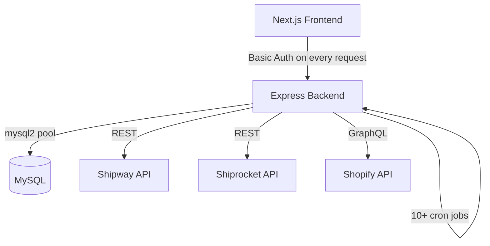
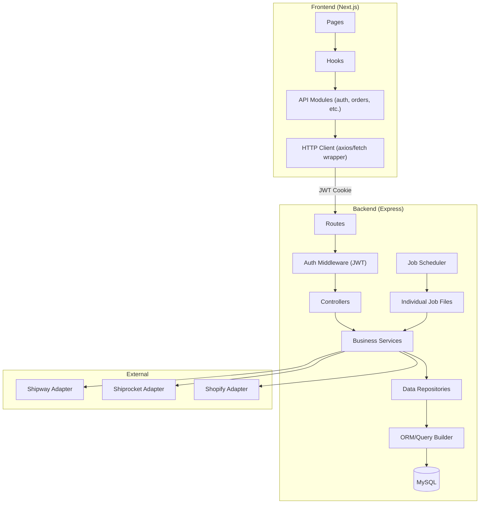

# 🔴 Clamio_v2 — Production-Grade Codebase Audit

## System Overview

**Clamio** is an order management platform connecting a Shopify store to shipping aggregators (Shipway/Shiprocket). Vendors claim orders, generate shipping labels, and manage fulfillment. Admin/superadmin users oversee the operation.

| Layer | Stack | Notes |
|-------|-------|-------|
| Frontend | Next.js 15 + React 19 + Tailwind + shadcn/ui | PWA-enabled |
| Backend | Express.js (Node) — single monolithic [server.js](file:///c:/Users/keval/Desktop/App%20Development/Claimio_v2/Clamio_v2/backend/server.js) | No TypeScript |
| Database | MySQL via `mysql2` connection pool | Schema managed in-code |
| External | Shipway API, Shiprocket API, Shopify GraphQL API | Auth tokens in DB/env |
| Auth | HTTP Basic Auth (password in every request) | Stored in `localStorage` |

### Architecture Diagram

---

## 🔴 CRITICAL ISSUES (Fix Immediately)

### C1. Basic Auth sends plaintext credentials on every request

| Detail | Value |
|--------|-------|
| **Files** | [auth.js](file:///c:/Users/keval/Desktop/App%20Development/Claimio_v2/Clamio_v2/backend/middleware/auth.js), [api.ts](file:///c:/Users/keval/Desktop/App%20Development/Claimio_v2/Clamio_v2/frontend/lib/api.ts) |
| **Problem** | Every API call includes the user's email+password Base64-encoded in the `Authorization` header. The frontend stores this in `localStorage`. |
| **Why it's bad** | Basic Auth is inherently insecure without HTTPS pinning. The password traverses the wire on *every single request*. `localStorage` is accessible to any XSS. A single XSS vulnerability gives the attacker the user's **actual password**, not just a session token. |
| **Risk** | Full account takeover via XSS. Credential exposure in logs, proxy servers, browser history, and network traces. |
| **Fix** | Switch to **JWT (access + refresh tokens)** or **session cookies** with `httpOnly`, `secure`, `SameSite=Strict`. Never store raw passwords client-side. |

### C2. Hardcoded default superadmin credentials logged to stdout

| Detail | Value |
|--------|-------|
| **File** | [server.js:541](file:///c:/Users/keval/Desktop/App%20Development/Claimio_v2/Clamio_v2/backend/server.js#L541) |
| **Problem** | `console.log('👤 Default superadmin: superadmin@example.com / password123');` runs on every server start. Line 542-543 also logs `SHOPIFY_ACCESS_TOKEN` and `SHOPIFY_PRODUCTS_API_URL`. |
| **Why it's bad** | Log aggregators, CI/CD outputs, and Railway deployment logs will contain these credentials. Anyone with log access gets full superadmin access and your Shopify store's admin API token. |
| **Risk** | Complete system compromise. Shopify store admin takeover. |
| **Fix** | Remove all credential logging. Create superadmin via a one-time migration script, not a hardcoded seed. |

### C3. `/env-check` endpoint leaks database credentials

| Detail | Value |
|--------|-------|
| **File** | [server.js:233-249](file:///c:/Users/keval/Desktop/App%20Development/Claimio_v2/Clamio_v2/backend/server.js#L233-L249) |
| **Problem** | Unauthenticated endpoint returns `DB_HOST`, `DB_USER`, `DB_PASSWORD`, `DB_NAME`, `DB_PORT`, `DB_SSL` values. |
| **Why it's bad** | Completely unauthenticated. Any attacker can hit `/env-check` and get your database credentials. |
| **Risk** | Direct database access, data exfiltration, data destruction. |
| **Fix** | **Delete this endpoint entirely.** If needed for debugging, gate it behind superadmin auth and redact passwords. |

### C4. Rate limiting is disabled

| Detail | Value |
|--------|-------|
| **File** | [server.js:112-133](file:///c:/Users/keval/Desktop/App%20Development/Claimio_v2/Clamio_v2/backend/server.js#L112-L133) |
| **Problem** | The entire rate limiting block is commented out with "TEMPORARILY DISABLED for testing". |
| **Why it's bad** | No protection against brute-force attacks on login, credential stuffing, or API abuse. Combined with Basic Auth, an attacker can try unlimited password combinations. |
| **Risk** | Brute-force account compromise. DDoS via resource exhaustion. |
| **Fix** | Re-enable rate limiting immediately. Apply stricter limits to auth endpoints (5 attempts per 15 minutes). |

### C5. SQL injection risk from dynamic query construction

| Detail | Value |
|--------|-------|
| **File** | [orders.js:7537-7542](file:///c:/Users/keval/Desktop/App%20Development/Claimio_v2/Clamio_v2/backend/routes/orders.js#L7537-L7542) |
| **Problem** | `const placeholders = order_ids.map(() => '?').join(',');` followed by string interpolation into SQL: `` `WHERE l.order_id IN (${placeholders})` ``. While the placeholders pattern is safe, the `database.js` file (8218 lines) likely has more instances. The 7585-line `orders.js` route file has too many inline SQL queries to audit thoroughly for injection. |
| **Why it's bad** | With 300KB of route logic and 296KB of database logic, hidden SQL injection vulnerabilities are statistically likely in a codebase of this size with no ORM and no centralized query builder. |
| **Risk** | Data breach, data manipulation, privilege escalation. |
| **Fix** | Use an ORM (Knex.js, Prisma, or Sequelize) or at minimum centralize all SQL queries in a query builder with parameterized queries. |

### C6. [encryptionService.js](file:///c:/Users/keval/Desktop/App%20Development/Claimio_v2/Clamio_v2/backend/services/encryptionService.js) generates random key on startup if env var missing

| Detail | Value |
|--------|-------|
| **File** | [encryptionService.js:21-26](file:///c:/Users/keval/Desktop/App%20Development/Claimio_v2/Clamio_v2/backend/services/encryptionService.js#L21-L26) |
| **Problem** | If `ENCRYPTION_KEY` is not set, a random key is generated. Every server restart generates a new key, making all previously encrypted data permanently unreadable. |
| **Why it's bad** | Silent data loss in production. The warning goes to console but the server starts happily. |
| **Risk** | Irreversible data corruption after restart. |
| **Fix** | If `ENCRYPTION_KEY` is missing, **crash the server** with a clear error. Never silently generate temporary cryptographic keys. |

---

## 🟠 HIGH-PRIORITY FIXES

### H1. [database.js](file:///c:/Users/keval/Desktop/App%20Development/Claimio_v2/Clamio_v2/backend/config/database.js) is a 8,218-line God Object

| Detail | Value |
|--------|-------|
| **File** | [database.js](file:///c:/Users/keval/Desktop/App%20Development/Claimio_v2/Clamio_v2/backend/config/database.js) (296 KB, 8,218 lines) |
| **Problem** | A single [Database](file:///c:/Users/keval/Desktop/App%20Development/Claimio_v2/Clamio_v2/backend/config/database.js#9-8216) class handles table creation, migrations, all CRUD for every entity, complex business queries, utility functions, and schema evolution. It is the single largest file in the codebase. |
| **Why it's bad** | Impossible to test in isolation. Any change risks breaking unrelated features. No code review can practically audit 8,000+ lines. Merge conflicts guaranteed with multiple developers. |
| **Risk** | Regression bugs, developer paralysis, total unmaintainability. |
| **Fix** | Split into repositories: `UserRepository`, `OrderRepository`, `SettlementRepository`, etc. Use a migration tool (Knex migrations, Prisma) for schema changes. |

### H2. [orders.js](file:///c:/Users/keval/Desktop/App%20Development/Claimio_v2/Clamio_v2/backend/routes/orders.js) route file is 7,585 lines

| Detail | Value |
|--------|-------|
| **File** | [orders.js](file:///c:/Users/keval/Desktop/App%20Development/Claimio_v2/Clamio_v2/backend/routes/orders.js) (306 KB, 7,585 lines) |
| **Problem** | Contains 50+ route handlers with inline business logic, database calls, external API calls, notification creation, label generation, PDF merging, cloning flows, and more. This is not a route file — it's the entire application. |
| **Why it's bad** | Violates single responsibility. Business logic is untestable because it's embedded in HTTP handlers. No separation between transport, business, and data layers. |
| **Risk** | Unable to refactor safely. Unable to write unit tests. Every bug fix risks introducing new bugs. |
| **Fix** | Extract into controllers → services → repositories. Route files should be <100 lines with only request parsing and response formatting. |

### H3. No database transactions for multi-step operations

| Detail | Value |
|--------|-------|
| **Files** | [orders.js](file:///c:/Users/keval/Desktop/App%20Development/Claimio_v2/Clamio_v2/backend/routes/orders.js) (claim, unclaim, bulk operations) |
| **Problem** | Operations like "claim order + assign carriers + update labels" are multiple independent UPDATE statements with no transaction wrapping. If step 2 fails, step 1 is already committed. |
| **Why it's bad** | Data inconsistency. An order can be "claimed" but have no carriers assigned. Clone operations can leave half-completed state. |
| **Risk** | Orphaned/corrupt orders, duplicate shipments, financial discrepancies. |
| **Fix** | Wrap multi-step operations in MySQL transactions (`BEGIN`/`COMMIT`/`ROLLBACK`). |

### H4. Race condition in claim/unclaim operations

| Detail | Value |
|--------|-------|
| **File** | [orders.js:437-552](file:///c:/Users/keval/Desktop/App%20Development/Claimio_v2/Clamio_v2/backend/routes/orders.js#L437-L552) |
| **Problem** | The claim flow: (1) reads order, (2) checks if unclaimed, (3) updates order. Between steps 1 and 3, another request can claim the same order (TOCTOU). |
| **Why it's bad** | Two vendors can "claim" the same order simultaneously. The last writer wins, leaving the first vendor thinking they have the order. |
| **Risk** | Duplicate shipments, financial disputes between vendors. |
| **Fix** | Use `UPDATE orders SET status='claimed' WHERE unique_id=? AND status='unclaimed'` in a single atomic query and check `affectedRows`. |

### H5. [optionalAuth](file:///c:/Users/keval/Desktop/App%20Development/Claimio_v2/Clamio_v2/backend/middleware/auth.js#219-245) middleware has a missing `await`

| Detail | Value |
|--------|-------|
| **File** | [auth.js:231](file:///c:/Users/keval/Desktop/App%20Development/Claimio_v2/Clamio_v2/backend/middleware/auth.js#L231) |
| **Problem** | `const user = database.getUserByEmail(email);` — missing `await`. [getUserByEmail](file:///c:/Users/keval/Desktop/App%20Development/Claimio_v2/Clamio_v2/backend/config/database.js#2642-2663) is async (MySQL query) but the result is never awaited. |
| **Why it's bad** | `user` will always be a Promise object (truthy), so `user && user.status === 'active'` will be `true && false` (Promise has no `.status` property). The auth silently fails to populate `req.user`. |
| **Risk** | Authentication bypass or silent auth failure depending on how [optionalAuth](file:///c:/Users/keval/Desktop/App%20Development/Claimio_v2/Clamio_v2/backend/middleware/auth.js#219-245) is used. |
| **Fix** | Add `await`: `const user = await database.getUserByEmail(email);`. Also make the whole middleware `async`. |

### H6. Excessive console.log in production code

| Detail | Value |
|--------|-------|
| **Files** | Every file. Especially [api.ts](file:///c:/Users/keval/Desktop/App%20Development/Claimio_v2/Clamio_v2/frontend/lib/api.ts), [orders.js](file:///c:/Users/keval/Desktop/App%20Development/Claimio_v2/Clamio_v2/backend/routes/orders.js) |
| **Problem** | Hundreds of `console.log` calls with emojis, including logging request headers, vendor tokens, full order objects, and authorization tokens. Frontend [api.ts](file:///c:/Users/keval/Desktop/App%20Development/Claimio_v2/Clamio_v2/frontend/lib/api.ts) logs `vendorToken` values. |
| **Why it's bad** | Leaks sensitive data to browser console (visible to any user). Server logs fill up disk. Performance overhead from serializing large objects. |
| **Risk** | Token leakage, credential exposure, log storage costs, performance degradation. |
| **Fix** | Use a structured logger (Winston/Pino) with log levels. Strip all `console.log` from frontend production builds. Never log tokens or passwords. |

### H7. Frontend stores vendor token in `localStorage` alongside Basic Auth

| Detail | Value |
|--------|-------|
| **File** | [api.ts:681-696](file:///c:/Users/keval/Desktop/App%20Development/Claimio_v2/Clamio_v2/frontend/lib/api.ts#L681-L696) |
| **Problem** | Both `authHeader` (Base64 email:password) and `vendorToken` are stored in `localStorage`. Some API calls use one, some use the other, creating a confused auth model. |
| **Why it's bad** | Dual auth mechanism. Neither is secure against XSS. The inconsistency means some endpoints may have weaker auth than expected. |
| **Risk** | XSS yields both the user's password AND their session token. |
| **Fix** | Unify on a single auth mechanism (JWT in httpOnly cookies). |

### H8. Migrations run on every server start

| Detail | Value |
|--------|-------|
| **File** | [server.js:468-850](file:///c:/Users/keval/Desktop/App%20Development/Claimio_v2/Clamio_v2/backend/server.js#L468-L849), [database.js:1-800](file:///c:/Users/keval/Desktop/App%20Development/Claimio_v2/Clamio_v2/backend/config/database.js#L1-L800) |
| **Problem** | `CREATE TABLE IF NOT EXISTS` + `ALTER TABLE ADD COLUMN` (wrapped in try/catch to ignore duplicates) runs every time the server starts. Multiple one-time migrations also run on every start. |
| **Why it's bad** | Slow startup. No migration versioning. No rollback capability. If a migration partially fails, there's no way to know the schema state. `ALTER TABLE` on large tables locks the table. |
| **Risk** | Table locks during deployment causing downtime. Schema drift between environments. |
| **Fix** | Use a proper migration tool (Knex, TypeORM, or Prisma). Run migrations as a separate deployment step with versioning and rollback. |

---

## 🟡 MEDIUM-PRIORITY FIXES

### M1. [api.ts](file:///c:/Users/keval/Desktop/App%20Development/Claimio_v2/Clamio_v2/frontend/lib/api.ts) is 1,805 lines with no separation

- Single file contains ALL API methods for users, orders, shipway, settlements, inventory, notifications, etc.
- **Fix**: Split into domain-specific API modules: `authApi.ts`, `ordersApi.ts`, `usersApi.ts`, etc.

### M2. Frontend dependencies pinned to `latest`

- 20+ Radix UI packages and several others are pinned to `"latest"` in [package.json](file:///c:/Users/keval/Desktop/App%20Development/Claimio_v2/Clamio_v2/frontend/package.json)
- **Risk**: Builds can break at any time with a new upstream release.
- **Fix**: Pin all dependencies to specific versions. Use Dependabot or Renovate for controlled updates.

### M3. Duplicate CORS handling

- Both `app.options('*')` handler and `cors()` middleware handle CORS. The manual handler runs first, duplicating logic.
- **Fix**: Remove the manual OPTIONS handler. Configure `cors()` properly.

### M4. `require()` inside route handlers

- Throughout [orders.js](file:///c:/Users/keval/Desktop/App%20Development/Claimio_v2/Clamio_v2/backend/routes/orders.js), `database` is re-imported via `const database = require('../config/database');` inside every route handler instead of at the top of the file.
- **Fix**: Import once at the top. The module is cached by Node anyway, but this is misleading and clutters every handler.

### M5. No input validation on most endpoints

- The claim endpoint only checks `if (!unique_id)`. No type checking, no length limits, no sanitization.
- Bulk-claim accepts an unbounded array with no size limit — an attacker can send 100,000 order IDs.
- **Fix**: Use `express-validator` (already installed but barely used) or `zod` for all input validation.

### M6. Error messages leak internal details

- `return res.status(500).json({ success: false, message: 'Internal server error: ' + error.message })` — internal errors exposed to clients.
- **Fix**: Log the real error server-side. Return generic messages to clients.

### M7. No test suite

- `jest` and `supertest` are in `devDependencies` but there are **zero test files** in the project.
- **Fix**: Start with integration tests for critical flows (claim, unclaim, label generation).

### M8. `unhandledRejection` calls `process.exit(1)`

- [server.js:452-455](file:///c:/Users/keval/Desktop/App%20Development/Claimio_v2/Clamio_v2/backend/server.js#L452-L455): crashes the entire server on any unhandled promise rejection.
- In production, this kills all active connections instantly.
- **Fix**: Log the error and let a process manager (PM2, systemd) handle restarts gracefully.

### M9. 10+ cron jobs defined inline in [server.js](file:///c:/Users/keval/Desktop/App%20Development/Claimio_v2/Clamio_v2/backend/server.js)

- Multi-store sync, carrier sync, order tracking, product refresh, product monitor, RTO tracking, RTO inventory, RTO cleanup, auto-reversal, criticality — all in one file.
- **Fix**: Extract cron jobs into a dedicated `jobs/` directory with individual job files and a job scheduler.

### M10. Dead code: commented-out Excel-based sync method

- [shipwayService.js:292-660](file:///c:/Users/keval/Desktop/App%20Development/Claimio_v2/Clamio_v2/backend/services/shipwayService.js#L292-L660): 368 lines of commented-out Excel-based sync code.
- **Fix**: Delete it. It's in git history if you ever need it.

---

## 🟢 LOW-PRIORITY CLEANUP

| # | Issue | File(s) |
|---|-------|---------|
| L1 | Project name inconsistency: "Claimio" vs "Clamio" vs "my-v0-project" | Root dir, package.json |
| L2 | Duplicate [postcss.config.js](file:///c:/Users/keval/Desktop/App%20Development/Claimio_v2/Clamio_v2/frontend/postcss.config.js) + [postcss.config.mjs](file:///c:/Users/keval/Desktop/App%20Development/Claimio_v2/Clamio_v2/frontend/postcss.config.mjs) | frontend/ |
| L3 | Duplicate [tailwind.config.js](file:///c:/Users/keval/Desktop/App%20Development/Claimio_v2/Clamio_v2/frontend/tailwind.config.js) + [tailwind.config.ts](file:///c:/Users/keval/Desktop/App%20Development/Claimio_v2/Clamio_v2/frontend/tailwind.config.ts) | frontend/ |
| L4 | Duplicate [globals.css](file:///c:/Users/keval/Desktop/App%20Development/Claimio_v2/Clamio_v2/frontend/app/globals.css) in both [app/](file:///c:/Users/keval/Desktop/App%20Development/Claimio_v2/Clamio_v2/backend/config/database.js#6882-6903) and `components/` | frontend/ |
| L5 | `node-cron` and `node-fetch` are in frontend dependencies (shouldn't be) | frontend/package.json |
| L6 | Loose scripts at backend root: [check-carrier-auth.js](file:///c:/Users/keval/Desktop/App%20Development/Claimio_v2/Clamio_v2/backend/check-carrier-auth.js), [fix-corrupted-labels.js](file:///c:/Users/keval/Desktop/App%20Development/Claimio_v2/Clamio_v2/backend/fix-corrupted-labels.js), etc. | backend/ |
| L7 | `keywords: ["excel-database"]` in backend package.json (legacy from Excel era) | backend/package.json |
| L8 | `multer` dependency installed but likely unused (no file upload handlers visible) | backend/package.json |
| L9 | Both `cron` and `node-cron` in dependencies | backend/package.json |
| L10 | JWT functions exported from auth.js "for backward compatibility" but return null | backend/middleware/auth.js |

---

## Recommended Architecture

### Key structural improvements needed:

1. **Route → Controller → Service → Repository** layering
2. **Repository pattern** to replace the 8,218-line [database.js](file:///c:/Users/keval/Desktop/App%20Development/Claimio_v2/Clamio_v2/backend/config/database.js)
3. **Proper migration system** (Knex, Prisma, or TypeORM)
4. **JWT + httpOnly cookies** replacing Basic Auth
5. **Input validation middleware** on all endpoints
6. **Structured logging** (Winston/Pino) with log levels
7. **Job scheduler** extracted from [server.js](file:///c:/Users/keval/Desktop/App%20Development/Claimio_v2/Clamio_v2/backend/server.js)
8. **Error handling strategy** with domain-specific error classes
9. **Environment-based configuration** with validation (e.g., `convict` or `envalid`)
10. **Test infrastructure** with at least integration tests for critical paths

---

## 🏆 Top 10 Fixes (Ordered by Priority)

| # | Fix | Effort | Impact |
|---|-----|--------|--------|
| 1 | **Delete `/env-check` endpoint** — leaks DB credentials to the internet | 1 min | 🔴 Critical |
| 2 | **Remove credential logging** from server.js (lines 541-543) | 1 min | 🔴 Critical |
| 3 | **Re-enable rate limiting** on all endpoints, especially auth | 10 min | 🔴 Critical |
| 4 | **Crash on missing `ENCRYPTION_KEY`** instead of generating random key | 5 min | 🔴 Critical |
| 5 | **Fix [optionalAuth](file:///c:/Users/keval/Desktop/App%20Development/Claimio_v2/Clamio_v2/backend/middleware/auth.js#219-245) missing `await`** — potential auth bypass | 2 min | 🟠 High |
| 6 | **Add atomic claim query** — prevent race condition on order claiming | 30 min | 🟠 High |
| 7 | **Add input validation** (array size limits on bulk endpoints) | 2 hours | 🟠 High |
| 8 | **Strip console.log from frontend** and sensitive data from server logs | 4 hours | 🟠 High |
| 9 | **Plan migration to JWT auth** — replace Basic Auth + localStorage | 2-3 days | 🔴 Critical (but complex) |
| 10 | **Split [orders.js](file:///c:/Users/keval/Desktop/App%20Development/Claimio_v2/Clamio_v2/backend/routes/orders.js) route** into at least 5 controller files | 1-2 days | 🟠 High |

> [!CAUTION]
> Items 1-4 should be done **today**. They are trivial fixes that close critical security holes. Item 5 is a 2-minute fix. Do those first before tackling the architectural refactors.
