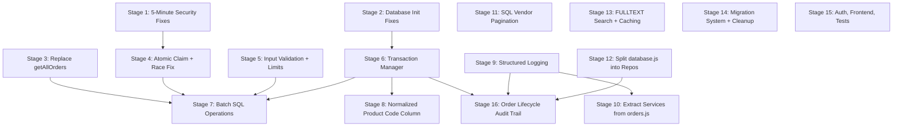

# Master Implementation Plan — Clamio_v2

> Consolidated from: [audit_report.md](file:///C:/Users/keval/.gemini/antigravity/brain/3d73e157-751f-4def-9775-2634848111a8/audit_report.md), [approach_audit_report.md](file:///C:/Users/keval/.gemini/antigravity/brain/3d73e157-751f-4def-9775-2634848111a8/approach_audit_report.md), [database_orders_audit.md](file:///C:/Users/keval/.gemini/antigravity/brain/3d73e157-751f-4def-9775-2634848111a8/database_orders_audit.md)
> 
> **65 issues → 15 stages → dependency-ordered**
> 
> Independent tasks first. Each stage is small enough for 1 developer in 1-3 days.

---

## Dependency Map



**Stages 1–5** are fully independent — can be done in any order or in parallel.
**Stage 6** must come before 7 and 8. **Stage 9** should come before 10.

---

## Stage 1: Emergency Security Fixes

> ⏱ **Time: 30 minutes** | 🔴 Priority: Critical | Dependencies: None

5 zero-risk, zero-downtime fixes. Do these today.

### 1.1 Delete `/env-check` endpoint
- **File:** [server.js:233-249](file:///c:/Users/keval/Desktop/App%20Development/Claimio_v2/Clamio_v2/backend/server.js#L233-L249)
- **Action:** Delete the entire route handler for `/env-check`
- **Why:** Unauthenticated endpoint returns `DB_HOST`, `DB_USER`, `DB_PASSWORD` to anyone

### 1.2 Remove credential logging
- **File:** [server.js:541-543](file:///c:/Users/keval/Desktop/App%20Development/Claimio_v2/Clamio_v2/backend/server.js#L541-L543)
- **Action:** Delete lines logging superadmin password, `SHOPIFY_ACCESS_TOKEN`, and `SHOPIFY_PRODUCTS_API_URL`
- **Why:** Log aggregators expose these to anyone with log access

### 1.3 Re-enable rate limiting
- **File:** [server.js:112-133](file:///c:/Users/keval/Desktop/App%20Development/Claimio_v2/Clamio_v2/backend/server.js#L112-L133)
- **Action:** Uncomment the rate limiting block. Add stricter limits for auth endpoints:
  ```javascript
  const authLimiter = rateLimit({ windowMs: 15 * 60 * 1000, max: 5 });
  app.use('/api/auth/login', authLimiter);
  ```
- **Why:** No brute-force protection on login combined with Basic Auth = trivial password guessing

### 1.4 Crash on missing ENCRYPTION_KEY
- **File:** [encryptionService.js:21-26](file:///c:/Users/keval/Desktop/App%20Development/Claimio_v2/Clamio_v2/backend/services/encryptionService.js#L21-L26)
- **Action:** Replace random key generation with:
  ```javascript
  if (!process.env.ENCRYPTION_KEY) {
    throw new Error('FATAL: ENCRYPTION_KEY environment variable is required');
  }
  ```
- **Why:** Random key on restart = all previously encrypted data is permanently lost

### 1.5 Fix missing `await` in optionalAuth
- **File:** [auth.js:231](file:///c:/Users/keval/Desktop/App%20Development/Claimio_v2/Clamio_v2/backend/middleware/auth.js#L231)
- **Action:** Change `const user = database.getUserByEmail(email)` → `const user = await database.getUserByEmail(email)`
- **Why:** Without `await`, user is always a Promise (truthy), so auth check is bypassed

---

## Stage 2: Database Initialization Fixes

> ⏱ **Time: 1-2 hours** | 🟠 Priority: High | Dependencies: None

### 2.1 Fix SQL injection in CREATE DATABASE
- **File:** [database.js:42](file:///c:/Users/keval/Desktop/App%20Development/Claimio_v2/Clamio_v2/backend/config/database.js#L42)
- **Action:** Sanitize the database name:
  ```javascript
  const safeName = dbConfig.database.replace(/[^a-zA-Z0-9_]/g, '');
  await connection.execute(`CREATE DATABASE IF NOT EXISTS \`${safeName}\``);
  ```

### 2.2 Fix `mysqlInitialized` tri-state
- **File:** [database.js:10-84](file:///c:/Users/keval/Desktop/App%20Development/Claimio_v2/Clamio_v2/backend/config/database.js#L10-L84)
- **Action:** Replace boolean with tri-state:
  ```javascript
  this.mysqlState = 'pending'; // 'pending' | 'ready' | 'failed'
  ```
  In catch block: set to `'failed'` instead of `true`. Update [waitForMySQLInitialization()](file:///c:/Users/keval/Desktop/App%20Development/Claimio_v2/Clamio_v2/backend/config/database.js#5226-5237) to reject when `'failed'`.

### 2.3 Rename `mysqlConnection` to `pool`
- **File:** [database.js:61](file:///c:/Users/keval/Desktop/App%20Development/Claimio_v2/Clamio_v2/backend/config/database.js#L61) + all usages
- **Action:** Find-and-replace `this.mysqlConnection` → `this.pool` so the code doesn't lie about what it is

### 2.4 Add pool error handling and queue limit
- **File:** [database.js:46-57](file:///c:/Users/keval/Desktop/App%20Development/Claimio_v2/Clamio_v2/backend/config/database.js#L46-L57)
- **Action:** Add:
  ```javascript
  queueLimit: 100,        // Reject with error instead of unlimited queue
  acquireTimeout: 10000,  // 10s timeout for getting a connection
  ```
  Add pool event listeners:
  ```javascript
  this.mysqlPool.on('error', (err) => {
    console.error('Pool error:', err.code);
  });
  ```

---

## Stage 3: Replace [getAllOrders()](file:///c:/Users/keval/Desktop/App%20Development/Claimio_v2/Clamio_v2/backend/config/database.js#3900-3975) Calls

> ⏱ **Time: 2-3 hours** | 🔴 Priority: Critical | Dependencies: None

This is the **single highest-risk performance issue**. Each call loads the entire DB into RAM.

### 3.1 Create [getOrdersByOrderId()](file:///c:/Users/keval/Desktop/App%20Development/Claimio_v2/Clamio_v2/backend/config/database.js#3733-3783) method
- **File:** [database.js](file:///c:/Users/keval/Desktop/App%20Development/Claimio_v2/Clamio_v2/backend/config/database.js)
- **Action:** Add a new method:
  ```javascript
  async getOrdersByOrderId(orderId) {
    const [rows] = await this.pool.execute(
      `SELECT o.*, c.status as claims_status, c.claimed_by, c.claimed_at,
              c.label_downloaded, c.priority_carrier, c.clone_status,
              c.cloned_order_id, c.is_cloned_row,
              l.label_url, l.awb, l.carrier_name,
              s.store_name, s.account_code as store_account_code
       FROM orders o
       LEFT JOIN claims c ON o.unique_id = c.order_unique_id
       LEFT JOIN labels l ON o.order_id = l.order_id AND o.account_code = l.account_code
       LEFT JOIN store_info s ON o.account_code = s.account_code
       WHERE o.order_id = ?`,
      [orderId]
    );
    return rows;
  }
  ```

### 3.2 Replace in download-label route
- **File:** [orders.js:2649](file:///c:/Users/keval/Desktop/App%20Development/Claimio_v2/Clamio_v2/backend/routes/orders.js#L2649)
- **Action:** Change:
  ```diff
  - const orders = await database.getAllOrders();
  - const orderProducts = orders.filter(order => order.order_id === order_id);
  + const orderProducts = await database.getOrdersByOrderId(order_id);
  ```

### 3.3 Replace in mark-ready route
- **File:** [orders.js:5564](file:///c:/Users/keval/Desktop/App%20Development/Claimio_v2/Clamio_v2/backend/routes/orders.js#L5564)
- **Action:** Same replacement as 3.2

### 3.4 Search for other [getAllOrders()](file:///c:/Users/keval/Desktop/App%20Development/Claimio_v2/Clamio_v2/backend/config/database.js#3900-3975) callers and replace
- **Action:** `grep -rn "getAllOrders" backend/` — replace every occurrence with a targeted query

---

## Stage 4: Fix Race Conditions (Atomic Claim)

> ⏱ **Time: 3-4 hours** | 🔴 Priority: Critical | Dependencies: None

### 4.1 Create `atomicClaimOrder()` in database.js
- **File:** [database.js](file:///c:/Users/keval/Desktop/App%20Development/Claimio_v2/Clamio_v2/backend/config/database.js)
- **Action:** Add:
  ```javascript
  async atomicClaimOrder(uniqueId, warehouseId, priorityCarrier) {
    const now = new Date().toISOString().replace('T', ' ').substring(0, 19);
    const [result] = await this.pool.execute(
      `UPDATE claims SET status='claimed', claimed_by=?, claimed_at=?,
              last_claimed_by=?, last_claimed_at=?, priority_carrier=?
       WHERE order_unique_id=? AND status='unclaimed'`,
      [warehouseId, now, warehouseId, now, priorityCarrier || '', uniqueId]
    );
    return result.affectedRows === 1; // true = claimed, false = already taken
  }
  ```

### 4.2 Refactor single `/claim` route
- **File:** [orders.js:437-552](file:///c:/Users/keval/Desktop/App%20Development/Claimio_v2/Clamio_v2/backend/routes/orders.js#L437-L552)
- **Action:** Replace read-check-write with:
  ```javascript
  // Get carrier first (can fail without side effects)
  let priorityCarrier = '';
  try {
    priorityCarrier = await carrierServiceabilityService.getTop3PriorityCarriers(order);
  } catch (e) { /* non-fatal */ }
  
  // Atomic claim — no race condition
  const claimed = await database.atomicClaimOrder(unique_id, warehouseId, priorityCarrier);
  if (!claimed) {
    return res.status(409).json({ success: false, message: 'Order already claimed by another vendor' });
  }
  ```

### 4.3 Refactor `/bulk-claim` to use atomic claims
- **File:** [orders.js:559-736](file:///c:/Users/keval/Desktop/App%20Development/Claimio_v2/Clamio_v2/backend/routes/orders.js#L559-L736)
- **Action:** In [processSingleOrder()](file:///c:/Users/keval/Desktop/App%20Development/Claimio_v2/Clamio_v2/backend/routes/orders.js#623-689), replace the read-check-write with `atomicClaimOrder()`

### 4.4 Create `atomicUnclaimOrder()` similarly
- Same pattern for unclaim: `UPDATE claims SET status='unclaimed' WHERE order_unique_id=? AND claimed_by=?`

---

## Stage 5: Input Validation & Size Limits

> ⏱ **Time: 3-4 hours** | 🟠 Priority: High | Dependencies: None

### 5.1 Add batch size limits to ALL bulk endpoints
- **Files:** All bulk routes in [orders.js](file:///c:/Users/keval/Desktop/App%20Development/Claimio_v2/Clamio_v2/backend/routes/orders.js) — `/bulk-claim` (L559), `/bulk-assign` (~L1940), `/bulk-unassign` (~L2051), `/bulk-download-labels`, `/bulk-mark-ready` (L5675)
- **Action:** Add at top of each handler:
  ```javascript
  const MAX_BATCH_SIZE = 200;
  if (unique_ids.length > MAX_BATCH_SIZE) {
    return res.status(400).json({
      success: false,
      message: `Maximum ${MAX_BATCH_SIZE} orders per batch request`
    });
  }
  ```

### 5.2 Add type validation to critical inputs
- **Action:** For each endpoint, validate:
  - `unique_id` is a non-empty string
  - `order_id` is a non-empty string
  - `unique_ids` / `order_ids` are arrays of strings, no duplicates
  - Pagination params (`page`, `limit`) are positive integers, `limit` ≤ 100

### 5.3 Sanitize error messages sent to clients
- **Files:** All routes
- **Action:** Replace:
  ```diff
  - res.status(500).json({ message: 'Error: ' + error.message });
  + console.error('Internal error:', error);
  + res.status(500).json({ success: false, message: 'An internal error occurred' });
  ```

### 5.4 Remove duplicate CORS handling
- **File:** [server.js](file:///c:/Users/keval/Desktop/App%20Development/Claimio_v2/Clamio_v2/backend/server.js)
- **Action:** Remove manual `app.options('*')` handler. Keep only the `cors()` middleware.

---

## Stage 6: Transaction Manager

> ⏱ **Time: 1 day** | 🔴 Priority: Critical | Dependencies: Stage 2 (pool naming)

### 6.1 Create `TransactionManager` utility
- **File:** [NEW] `backend/utils/transactionManager.js`
- **Action:**
  ```javascript
  class TransactionManager {
    constructor(pool) { this.pool = pool; }
    
    async runInTransaction(callback) {
      const conn = await this.pool.getConnection();
      await conn.beginTransaction();
      try {
        const result = await callback(conn);
        await conn.commit();
        return result;
      } catch (err) {
        await conn.rollback();
        throw err;
      } finally {
        conn.release();
      }
    }
  }
  module.exports = TransactionManager;
  ```

### 6.2 Wrap [updateOrder()](file:///c:/Users/keval/Desktop/App%20Development/Claimio_v2/Clamio_v2/backend/config/database.js#4996-5139) in a transaction
- **File:** [database.js:5002-5137](file:///c:/Users/keval/Desktop/App%20Development/Claimio_v2/Clamio_v2/backend/config/database.js#L5002-L5137)
- **Action:** Get a dedicated connection from pool, wrap all 6 queries in `BEGIN`/`COMMIT`, `ROLLBACK` on failure. Remove the final unnecessary [getOrderByUniqueId()](file:///c:/Users/keval/Desktop/App%20Development/Claimio_v2/Clamio_v2/backend/config/database.js#3683-3732) re-read.

### 6.3 Wrap carrier priority swap
- **File:** [database.js:2173-2240](file:///c:/Users/keval/Desktop/App%20Development/Claimio_v2/Clamio_v2/backend/config/database.js#L2173-L2240)
- **Action:** Fix existing broken transaction (currently calls `beginTransaction()` on pool). Use `pool.getConnection()` first.

### 6.4 Wrap label download flow
- **File:** [orders.js:2719-2760](file:///c:/Users/keval/Desktop/App%20Development/Claimio_v2/Clamio_v2/backend/routes/orders.js#L2719-L2760)
- **Action:** Wrap [upsertLabel](file:///c:/Users/keval/Desktop/App%20Development/Claimio_v2/Clamio_v2/backend/config/database.js#5338-5417) + the product [updateOrder](file:///c:/Users/keval/Desktop/App%20Development/Claimio_v2/Clamio_v2/backend/config/database.js#4996-5139) loop in a single transaction:
  ```javascript
  await txManager.runInTransaction(async (conn) => {
    await upsertLabel(conn, labelData);
    await conn.execute(
      `UPDATE claims SET label_downloaded=1 WHERE order_unique_id IN (...)`,
      productUniqueIds
    );
  });
  ```

### 6.5 Wrap mark-ready flow
- **File:** [orders.js:5618-5640](file:///c:/Users/keval/Desktop/App%20Development/Claimio_v2/Clamio_v2/backend/routes/orders.js#L5618-L5640)
- **Action:** Wrap [upsertLabel](file:///c:/Users/keval/Desktop/App%20Development/Claimio_v2/Clamio_v2/backend/config/database.js#5338-5417) + status updates in a single transaction

---

## Stage 7: Batch SQL Operations

> ⏱ **Time: 2 days** | 🟠 Priority: High | Dependencies: Stage 6 (transactions)

### 7.1 Batch UPDATE for bulk-claim
- **File:** [orders.js:559-736](file:///c:/Users/keval/Desktop/App%20Development/Claimio_v2/Clamio_v2/backend/routes/orders.js#L559-L736)
- **Action:** Replace individual [updateOrder()](file:///c:/Users/keval/Desktop/App%20Development/Claimio_v2/Clamio_v2/backend/config/database.js#4996-5139) calls with:
  ```javascript
  await txManager.runInTransaction(async (conn) => {
    const placeholders = uniqueIds.map(() => '?').join(',');
    await conn.execute(
      `UPDATE claims SET status='claimed', claimed_by=?, claimed_at=?
       WHERE order_unique_id IN (${placeholders}) AND status='unclaimed'`,
      [warehouseId, now, ...uniqueIds]
    );
  });
  ```

### 7.2 Batch UPDATE for bulk-assign
- **File:** [orders.js:~1940-2043](file:///c:/Users/keval/Desktop/App%20Development/Claimio_v2/Clamio_v2/backend/routes/orders.js#L1940-L2043)
- **Action:** Fetch all orders in one `WHERE unique_id IN (...)`, do parallel carrier lookups with `Promise.allSettled()`, then batch update

### 7.3 Batch UPDATE for bulk-unassign
- **File:** [orders.js:~2051-2219](file:///c:/Users/keval/Desktop/App%20Development/Claimio_v2/Clamio_v2/backend/routes/orders.js#L2051-L2219)
- **Action:** Same pattern as 7.2

### 7.4 Batch UPDATE for mark-downloaded (label flow)
- **File:** [orders.js:2750-2755](file:///c:/Users/keval/Desktop/App%20Development/Claimio_v2/Clamio_v2/backend/routes/orders.js#L2750-L2755)
- **Action:** Replace sequential loop with single `UPDATE claims SET label_downloaded=1 WHERE order_unique_id IN (...)`

### 7.5 Fix [bulkUpdateOrders()](file:///c:/Users/keval/Desktop/App%20Development/Claimio_v2/Clamio_v2/backend/config/database.js#5140-5166) in database.js
- **File:** [database.js:5145-5165](file:///c:/Users/keval/Desktop/App%20Development/Claimio_v2/Clamio_v2/backend/config/database.js#L5145-L5165)
- **Action:** Wrap entire loop in a single transaction. Better: use batch SQL where the update fields are the same.

---

## Stage 8: Normalized Product Code Column

> ⏱ **Time: 1-2 days** | 🔴 Priority: Critical | Dependencies: Stage 6 (transactions)

### 8.1 Add `normalized_product_code` column to orders table
- **Action:** Migration:
  ```sql
  ALTER TABLE orders ADD COLUMN normalized_product_code VARCHAR(255);
  CREATE INDEX idx_normalized_code ON orders(normalized_product_code);
  ```

### 8.2 Create normalization function
- **File:** [NEW] `backend/utils/productCodeNormalizer.js`
- **Action:** Port the REGEXP_REPLACE logic to JavaScript (runs once on insert):
  ```javascript
  function normalizeProductCode(code) {
    if (!code) return null;
    let normalized = code.trim();
    // Strip size suffixes: -XS, -S, -M, -L, etc.
    normalized = normalized.replace(/[-_](XS|S|M|L|XL|XXL|XXXL|2XL|3XL|4XL|5XL)$/i, '');
    // Strip numeric suffixes: -123, -123-456
    normalized = normalized.replace(/[-_]\d+(-\d+)?$/, '');
    // Clean double separators
    normalized = normalized.replace(/[-_]{2,}/g, '-').trim();
    return normalized;
  }
  ```

### 8.3 Backfill existing data
- **Action:** One-time migration:
  ```sql
  UPDATE orders SET normalized_product_code = 
    REGEXP_REPLACE(TRIM(REGEXP_REPLACE(product_code, '[-_](XS|S|M|...)$', '')), '[-_]{2,}', '-')
  WHERE normalized_product_code IS NULL;
  ```

### 8.4 Set on every insert/update
- **File:** Wherever orders are inserted (shipwayService.js sync, database.js upsert)
- **Action:** Call `normalizeProductCode()` before INSERT/UPDATE, store result in column

### 8.5 Replace REGEXP_REPLACE JOINs
- **Files:** [database.js:4086](file:///c:/Users/keval/Desktop/App%20Development/Claimio_v2/Clamio_v2/backend/config/database.js#L4086), [L4325](file:///c:/Users/keval/Desktop/App%20Development/Claimio_v2/Clamio_v2/backend/config/database.js#L4325), [L4788](file:///c:/Users/keval/Desktop/App%20Development/Claimio_v2/Clamio_v2/backend/config/database.js#L4788), [L4849](file:///c:/Users/keval/Desktop/App%20Development/Claimio_v2/Clamio_v2/backend/config/database.js#L4849)
- **Action:** Replace all 4 REGEXP_REPLACE JOIN blocks with:
  ```sql
  LEFT JOIN products p ON o.normalized_product_code = p.sku_id AND o.account_code = p.account_code
  ```
- **Impact:** 5M regex evaluations → 1 indexed lookup. ~100x speedup.

---

## Stage 9: Structured Logging

> ⏱ **Time: 1-2 days** | 🟠 Priority: High | Dependencies: None

### 9.1 Install and configure Pino logger
- **Action:**
  ```bash
  npm install pino pino-pretty
  ```
  Create `backend/utils/logger.js`:
  ```javascript
  const pino = require('pino');
  module.exports = pino({
    level: process.env.LOG_LEVEL || 'info',
    transport: process.env.NODE_ENV !== 'production'
      ? { target: 'pino-pretty' }
      : undefined,
    redact: ['req.headers.authorization', '*.password', '*.token']
  });
  ```

### 9.2 Replace `console.log` in orders.js (~200 calls)
- **File:** [orders.js](file:///c:/Users/keval/Desktop/App%20Development/Claimio_v2/Clamio_v2/backend/routes/orders.js)
- **Action:** 
  - `console.log('✅ ...')` → `logger.info({ orderId }, 'Order claimed')`
  - `console.error('❌ ...')` → `logger.error({ err, orderId }, 'Claim failed')`
  - **Delete** all lines logging: request headers, full order objects, token substrings, JSON.stringify of responses

### 9.3 Replace `console.log` in database.js, server.js, services
- **Action:** Same pattern across all backend files. Remove all emoji-based logging.

### 9.4 Strip frontend `console.log` in production
- **File:** [api.ts](file:///c:/Users/keval/Desktop/App%20Development/Claimio_v2/Clamio_v2/frontend/lib/api.ts)
- **Action:** Remove all `console.log` of `vendorToken`, request details, response bodies. Use `if (process.env.NODE_ENV === 'development')` guard for any debug logging.

### 9.5 Fix `unhandledRejection` crash
- **File:** [server.js:452-455](file:///c:/Users/keval/Desktop/App%20Development/Claimio_v2/Clamio_v2/backend/server.js#L452-L455)
- **Action:** Replace `process.exit(1)` with `logger.fatal(err, 'Unhandled rejection')`. Let PM2/systemd handle restarts.

---

## Stage 10: Extract Services from orders.js

> ⏱ **Time: 3-5 days** | 🟠 Priority: High | Dependencies: Stage 9 (logging)

### 10.1 Extract `utils/orderGrouping.js`
- **Action:** Move the copy-pasted grouping block (appears 4 times) into one shared function:
  ```javascript
  function groupOrdersByOrderId(orders) { /* single implementation */ }
  ```
  Replace all 4 usages in orders.js.

### 10.2 Extract `utils/notificationHelper.js`
- **From:** [orders.js:1-196](file:///c:/Users/keval/Desktop/App%20Development/Claimio_v2/Clamio_v2/backend/routes/orders.js#L1-L196)
- **Action:** Move [createLabelGenerationNotification()](file:///c:/Users/keval/Desktop/App%20Development/Claimio_v2/Clamio_v2/backend/routes/orders.js#13-197) to its own file

### 10.3 Extract `services/claimService.js`
- **Action:** Move claim/unclaim/bulk-claim/bulk-unclaim business logic. Routes call:
  ```javascript
  const claimService = require('../services/claimService');
  router.post('/claim', async (req, res) => {
    const result = await claimService.claimOrder(req.body.unique_id, req.user);
    return res.json(result);
  });
  ```

### 10.4 Extract `services/labelService.js`
- **Action:** Move [generateLabelForOrder()](file:///c:/Users/keval/Desktop/App%20Development/Claimio_v2/Clamio_v2/backend/routes/orders.js#2961-3377), `formatLabelPDF()`, label caching logic, bulk-download orchestration

### 10.5 Extract `services/cloneService.js`
- **From:** [orders.js:3476-3900+](file:///c:/Users/keval/Desktop/App%20Development/Claimio_v2/Clamio_v2/backend/routes/orders.js#L3476)
- **Action:** Move [handleOrderCloning()](file:///c:/Users/keval/Desktop/App%20Development/Claimio_v2/Clamio_v2/backend/routes/orders.js#3476-3705), [prepareInputData()](file:///c:/Users/keval/Desktop/App%20Development/Claimio_v2/Clamio_v2/backend/routes/orders.js#3805-3896), [createCloneOrderOnly()](file:///c:/Users/keval/Desktop/App%20Development/Claimio_v2/Clamio_v2/backend/routes/orders.js#3960-3993), [verifyCloneExists()](file:///c:/Users/keval/Desktop/App%20Development/Claimio_v2/Clamio_v2/backend/routes/orders.js#3994-4023), [retryOperation()](file:///c:/Users/keval/Desktop/App%20Development/Claimio_v2/Clamio_v2/backend/routes/orders.js#3711-3743), and all helper functions

### 10.6 Extract `services/manifestService.js`
- **Action:** Move `/mark-ready` and `/bulk-mark-ready` business logic + [callShipwayCreateManifestAPI()](file:///c:/Users/keval/Desktop/App%20Development/Claimio_v2/Clamio_v2/backend/routes/orders.js#4338-4441)

### 10.7 Extract `services/adminOrderService.js`
- **Action:** Move admin assign, unassign, bulk-assign, bulk-unassign, dashboard stats logic

### 10.8 Move `require()` to top of orders.js
- **Action:** Replace all inline `const database = require(...)` with a single import at the top of the file

**Result:** [orders.js](file:///c:/Users/keval/Desktop/App%20Development/Claimio_v2/Clamio_v2/backend/routes/orders.js) goes from 7,585 lines → ~500 lines (route definitions only)

---

## Stage 11: SQL-Level Vendor Pagination

> ⏱ **Time: 2-3 days** | 🔴 Priority: Critical | Dependencies: Stage 8 (normalized column)

### 11.1 Create `getMyOrdersPaginated()` in database.js
- **Action:**
  ```javascript
  async getMyOrdersPaginated(warehouseId, { page, limit, search }) {
    const offset = (page - 1) * limit;
    // Count query
    const [countResult] = await this.pool.execute(
      `SELECT COUNT(DISTINCT o.order_id) as total
       FROM orders o JOIN claims c ON o.unique_id = c.order_unique_id
       WHERE c.claimed_by = ? AND c.status = 'claimed'
             AND (o.is_handover IS NULL OR o.is_handover != 1)`,
      [warehouseId]
    );
    // Paginated grouped query
    const [rows] = await this.pool.execute(
      `SELECT o.order_id, MIN(o.order_date) as order_date,
              COUNT(*) as total_products, SUM(o.quantity) as total_quantity
       FROM orders o JOIN claims c ON o.unique_id = c.order_unique_id
       WHERE c.claimed_by = ? AND c.status = 'claimed'
             AND (o.is_handover IS NULL OR o.is_handover != 1)
       GROUP BY o.order_id
       ORDER BY order_date DESC
       LIMIT ? OFFSET ?`,
      [warehouseId, limit, offset]
    );
    // Fetch products for returned order_ids only
    if (rows.length > 0) {
      const orderIds = rows.map(r => r.order_id);
      // ... fetch products for these specific IDs
    }
    return { orders: rows, total: countResult[0].total };
  }
  ```

### 11.2 Create paginated versions for handover, order-tracking, grouped
- **Action:** Same pattern for each endpoint

### 11.3 Update route handlers to use paginated methods
- **Files:** `/my-orders`, `/handover`, `/order-tracking`, `/grouped` routes
- **Action:** Replace `database.getMyOrders()` → `database.getMyOrdersPaginated()`

### 11.4 Remove JS-side grouping/sorting/slicing
- **Action:** Delete the `forEach` grouping blocks and `Array.slice()` pagination from all vendor routes

---

## Stage 12: Split database.js into Repositories

> ⏱ **Time: 3-5 days** | 🟡 Priority: Medium | Dependencies: Stage 6 (transactions), Stage 8 (normalized column)

### 12.1 Create `database/pool.js`
- **Action:** Extract pool creation, health check, and `waitForInitialization()` only (~80 lines)

### 12.2 Create `repositories/utilityRepo.js`
- **Action:** Move [getUtilityParameter()](file:///c:/Users/keval/Desktop/App%20Development/Claimio_v2/Clamio_v2/backend/config/database.js#1815-1836), [updateUtilityParameter()](file:///c:/Users/keval/Desktop/App%20Development/Claimio_v2/Clamio_v2/backend/config/database.js#1837-1862), [getAllUtilityParameters()](file:///c:/Users/keval/Desktop/App%20Development/Claimio_v2/Clamio_v2/backend/config/database.js#1863-1882) — simplest extraction

### 12.3 Create `repositories/carrierRepo.js`
- **Action:** Move all carrier CRUD methods

### 12.4 Create `repositories/orderRepo.js`
- **Action:** Move all order-related queries: [getOrderByUniqueId](file:///c:/Users/keval/Desktop/App%20Development/Claimio_v2/Clamio_v2/backend/config/database.js#3683-3732), [getOrdersByOrderId](file:///c:/Users/keval/Desktop/App%20Development/Claimio_v2/Clamio_v2/backend/config/database.js#3733-3783), [getOrdersPaginated](file:///c:/Users/keval/Desktop/App%20Development/Claimio_v2/Clamio_v2/backend/config/database.js#3976-4134), `getMyOrdersPaginated`, [searchOrders](file:///c:/Users/keval/Desktop/App%20Development/Claimio_v2/Clamio_v2/backend/config/database.js#5189-5225), [deleteOrder](file:///c:/Users/keval/Desktop/App%20Development/Claimio_v2/Clamio_v2/backend/config/database.js#5167-5188)

### 12.5 Create `repositories/claimRepo.js`
- **Action:** Move claim-related queries: `atomicClaimOrder`, `atomicUnclaimOrder`, bulk claim updates

### 12.6 Create `repositories/labelRepo.js`
- **Action:** Move [upsertLabel](file:///c:/Users/keval/Desktop/App%20Development/Claimio_v2/Clamio_v2/backend/config/database.js#5338-5417), [getLabelByOrderId](file:///c:/Users/keval/Desktop/App%20Development/Claimio_v2/Clamio_v2/backend/config/database.js#5310-5337), label-related queries

### 12.7 Create `repositories/userRepo.js`
- **Action:** Move user CRUD

### 12.8 Create `repositories/settlementRepo.js`
- **Action:** Move settlement CRUD

### 12.9 Create `services/statusService.js`
- **Action:** Move shipment status mapping, normalization, color coding, handover logic OUT of database layer into a service

### 12.10 Update all imports
- **Action:** Replace `require('../config/database')` → individual repo imports

**Result:** [database.js](file:///c:/Users/keval/Desktop/App%20Development/Claimio_v2/Clamio_v2/backend/config/database.js) goes from 8,218 lines → deleted, replaced by ~10 focused files

---

## Stage 13: FULLTEXT Search + Caching

> ⏱ **Time: 2-3 days** | 🟠 Priority: High | Dependencies: Stage 11 (pagination)

### 13.1 Add FULLTEXT index
- **Action:** Migration:
  ```sql
  ALTER TABLE orders ADD FULLTEXT INDEX ft_search (order_id, product_name, product_code, customer_name);
  ```

### 13.2 Replace `LIKE '%term%'` with FULLTEXT search
- **Files:** [database.js:4022-4032](file:///c:/Users/keval/Desktop/App%20Development/Claimio_v2/Clamio_v2/backend/config/database.js#L4022-L4032), [L4184-4194](file:///c:/Users/keval/Desktop/App%20Development/Claimio_v2/Clamio_v2/backend/config/database.js#L4184-L4194)
- **Action:** Replace:
  ```diff
  - WHERE o.order_id LIKE ? OR o.product_name LIKE ?
  + WHERE MATCH(o.order_id, o.product_name, o.product_code, o.customer_name) AGAINST(? IN BOOLEAN MODE)
  ```

### 13.3 Add debounce to vendor search (frontend)
- **Action:** Ensure ALL search inputs (not just admin) have 300-500ms debounce using `lodash.debounce`

### 13.4 Install and configure `node-cache` for dashboard stats
- **Action:**
  ```bash
  npm install node-cache
  ```
  ```javascript
  const NodeCache = require('node-cache');
  const statsCache = new NodeCache({ stdTTL: 60 }); // 60 second TTL
  ```
  Cache dashboard stats results. Invalidate on claim/unclaim/label events.

### 13.5 Add HTTP cache headers for read-only endpoints
- **Action:** For carrier list, product images, store info:
  ```javascript
  res.set('Cache-Control', 'public, max-age=30');
  ```

### 13.6 Select explicit columns instead of `SELECT *`
- **Action:** For list views, select only: `order_id, customer_name, order_date, product_name, status, claimed_by`. For detail views, include the full set.

---

## Stage 14: Migration System + Dead Code Cleanup

> ⏱ **Time: 2 days** | 🟡 Priority: Medium | Dependencies: Stage 12 (repos split)

### 14.1 Install Knex for migrations
- **Action:**
  ```bash
  npm install knex
  npx knex init
  ```
  Configure `knexfile.js` to use existing MySQL connection.

### 14.2 Create initial migration from current schema
- **Action:** Export current schema: `mysqldump --no-data > migrations/001_initial_schema.sql`
  Create Knex migration files for each table.

### 14.3 Remove `CREATE TABLE IF NOT EXISTS` from database init
- **Action:** Delete all 12 `createXxxTable()` methods. Replace with `knex migrate:latest`.

### 14.4 Delete dead code
- [shipwayService.js:292-660](file:///c:/Users/keval/Desktop/App%20Development/Claimio_v2/Clamio_v2/backend/services/shipwayService.js#L292-L660) — 368 lines of commented-out Excel sync
- [auth.js](file:///c:/Users/keval/Desktop/App%20Development/Claimio_v2/Clamio_v2/backend/middleware/auth.js) — JWT stub functions that return null
- Loose scripts at backend root: [check-carrier-auth.js](file:///c:/Users/keval/Desktop/App%20Development/Claimio_v2/Clamio_v2/backend/check-carrier-auth.js), [fix-corrupted-labels.js](file:///c:/Users/keval/Desktop/App%20Development/Claimio_v2/Clamio_v2/backend/fix-corrupted-labels.js), etc.

### 14.5 Extract cron jobs from server.js
- **File:** [server.js](file:///c:/Users/keval/Desktop/App%20Development/Claimio_v2/Clamio_v2/backend/server.js)
- **Action:** Create `jobs/` directory. Move each cron job to its own file. Create `jobs/scheduler.js` to register them all.

### 14.6 Fix dependency inconsistencies
- Pin frontend dependencies to specific versions (remove `"latest"`)
- Remove `node-cron` and `node-fetch` from frontend dependencies
- Remove duplicate [postcss.config.js](file:///c:/Users/keval/Desktop/App%20Development/Claimio_v2/Clamio_v2/frontend/postcss.config.js)/[.mjs](file:///c:/Users/keval/Desktop/App%20Development/Claimio_v2/Clamio_v2/frontend/next.config.mjs) and [tailwind.config.js](file:///c:/Users/keval/Desktop/App%20Development/Claimio_v2/Clamio_v2/frontend/tailwind.config.js)/[.ts](file:///c:/Users/keval/Desktop/App%20Development/Claimio_v2/Clamio_v2/frontend/lib/api.ts)
- Remove duplicate [globals.css](file:///c:/Users/keval/Desktop/App%20Development/Claimio_v2/Clamio_v2/frontend/app/globals.css)
- Remove unused `multer` dependency
- Remove `keywords: ["excel-database"]`
- Deduplicate `cron` and `node-cron` in backend

---

## Stage 15: Auth Upgrade, Frontend Improvements, Tests

> ⏱ **Time: 1-2 weeks** | 🟠 Priority: High (but complex) | Dependencies: Stages 10, 12

### 15.1 Plan JWT auth migration
- **Action:** Design:
  - `/api/auth/login` → returns `{ accessToken, refreshToken }` in httpOnly cookies
  - Access token: 15min, refresh token: 7 days
  - Replace all `localStorage.getItem('authHeader')` with cookie-based auth
  - Remove Basic Auth middleware, add JWT middleware

### 15.2 Implement JWT backend
- **Files:** auth middleware, authController
- **Action:** Install `jsonwebtoken`. Create `generateAccessToken()`, `generateRefreshToken()`, [verifyToken()](file:///c:/Users/keval/Desktop/App%20Development/Claimio_v2/Clamio_v2/backend/middleware/auth.js#290-295). Create `/api/auth/refresh` endpoint.

### 15.3 Update frontend auth
- **Files:** [api.ts](file:///c:/Users/keval/Desktop/App%20Development/Claimio_v2/Clamio_v2/frontend/lib/api.ts), login page
- **Action:** Remove `localStorage` auth storage. Use `credentials: 'include'` on fetch. Handle 401 → redirect to login.

### 15.4 Split [api.ts](file:///c:/Users/keval/Desktop/App%20Development/Claimio_v2/Clamio_v2/frontend/lib/api.ts) into modules
- **Action:** Create:
  - `frontend/lib/api/auth.ts`
  - `frontend/lib/api/orders.ts`
  - `frontend/lib/api/admin.ts`
  - `frontend/lib/api/settlements.ts`

### 15.5 Integrate TanStack Query (React Query)
- **Action:**
  ```bash
  npm install @tanstack/react-query
  ```
  Wrap app in `QueryClientProvider`. Convert API calls to `useQuery` / `useMutation` for automatic caching, deduplication, and background refetching.

### 15.6 Write integration tests for critical flows
- **Action:** Using `jest` + `supertest` (already installed):
  ```
  tests/
    integration/
      claim.test.js         — claim, double-claim race, bulk-claim
      label-download.test.js — download, cache hit, clone trigger
      unclaim.test.js       — unclaim, re-claim
      auth.test.js          — login, invalid creds, rate limiting
  ```

### 15.7 Fix project naming
- Standardize "Claimio" vs "Clamio" across all files, package.json, directory names

---

## Stage 16: Order Lifecycle Audit Trail

> ⏱ **Time: 3-5 days** | 🟠 Priority: High | Dependencies: Stage 6, 9, 12

Full design: [stage16_order_lifecycle.md](file:///C:/Users/keval/.gemini/antigravity/brain/4c3d4e1e-8196-45e5-a391-1005709699c7/stage16_order_lifecycle.md)

Every meaningful change to an order is written as an immutable event row in `order_lifecycle_events`. Querying by `order_id` returns the complete timestamped story: creation → claim → carrier → label → reversal → clone → delivery.

**Decisions:**
- Phase 1: DB table only — no HTTP endpoint yet
- 1-year data retention with nightly batched purge job
- 40+ event types across the full order lifecycle including clone chains
- Financial snapshot (price, total value, payment type) captured at time of event — immutable
- Clone events cross-reference parent ↔ clone in both directions

---

## Summary Table

| Stage | Description | Time | Priority | Depends On |
|-------|------------|------|----------|------------|
| **1** | Emergency security fixes | 30 min | 🔴 Critical | — |
| **2** | Database init fixes | 1-2 hrs | 🟠 High | — |
| **3** | Replace [getAllOrders()](file:///c:/Users/keval/Desktop/App%20Development/Claimio_v2/Clamio_v2/backend/config/database.js#3900-3975) | 2-3 hrs | 🔴 Critical | — |
| **4** | Atomic claim (race fix) | 3-4 hrs | 🔴 Critical | — |
| **5** | Input validation + limits | 3-4 hrs | 🟠 High | — |
| **6** | Transaction manager | 1 day | 🔴 Critical | Stage 2 |
| **7** | Batch SQL operations | 2 days | 🟠 High | Stage 6 |
| **8** | Normalized product code | 1-2 days | 🔴 Critical | Stage 6 |
| **9** | Structured logging | 1-2 days | 🟠 High | — |
| **10** | Extract services (orders.js) | 3-5 days | 🟠 High | Stage 9 |
| **11** | SQL vendor pagination | 2-3 days | 🔴 Critical | Stage 8 |
| **12** | Split database.js into repos | 3-5 days | 🟡 Medium | Stage 6, 8 |
| **13** | FULLTEXT search + caching | 2-3 days | 🟠 High | Stage 11 |
| **14** | Migration system + cleanup | 2 days | 🟡 Medium | Stage 12 |
| **15** | Auth, frontend, tests | 1-2 weeks | 🟠 High | Stage 10, 12 |
| **16** | Order lifecycle audit trail | 3-5 days | 🟠 High | Stage 6, 9, 12 |

> [!TIP]
> **Fastest impact path:** Stage 1 → 3 → 4 → 6 → 8 → 11
> This sequence fixes security, eliminates the OOM crash, prevents race conditions, adds transactions, and fixes the fake vendor pagination — all within ~10 days.
